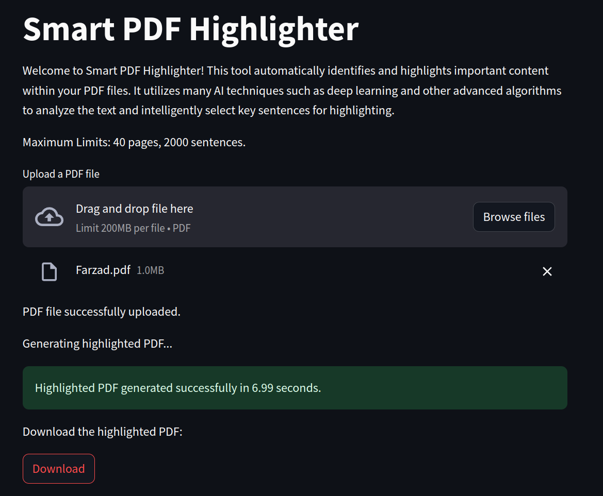
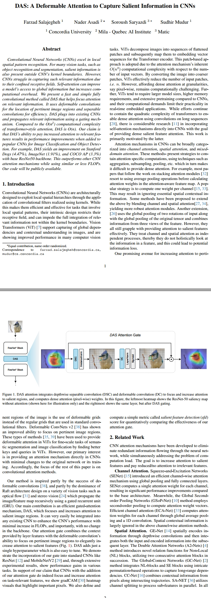
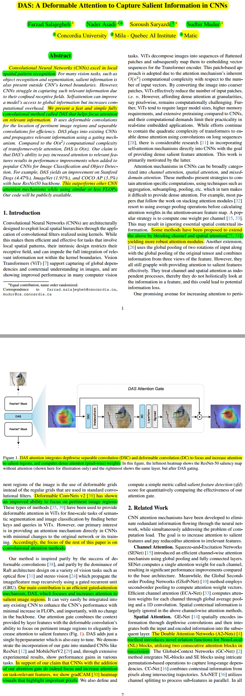

# Smart PDF Highlighter

Welcome to Smart PDF Highlighter! This tool finds and highlights important parts in your PDFs all by itself. It uses smart AI methods like deep learning and fancy algorithms to pick out the most important sentences.

## Overview



The Smart PDF Highlighter functions with the following workflow:

1. **User Interface**: Users interact with the Streamlit-based graphical user interface (GUI) to upload their PDF files.
2. **PDF Processing**: Upon file upload, the tool processes the PDF content to identify important sentences.
3. **Highlighting**: Important sentences are highlighted within the PDF, emphasizing key content.
4. **Download**: Users can download the highlighted PDF for further reference.

## Installation

To use the Smart PDF Highlighter, follow these simple steps:

1. **Clone the Repository:** Clone the repository to your local machine.
    ```python
    git clone https://github.com/FzS92/smart-pdf-highlighter.git
    cd smart-pdf-highlighter
    ```

2. **Create Virtual Environment:** Set up a Python 3.8 virtual environment and activate it.
    ```python
    conda create -n smart-pdf-env python=3.8
    conda activate smart-pdf-env
    ```

3. **Install Requirements:** Install the required dependencies.
    ```python
    pip install -r requirements.txt
    ```

## Usage

Follow these steps to run the Smart PDF Highlighter:

1. **Run the Application:** Execute the `app.py` script to start the Streamlit application.
    ```python
    streamlit run app.py
    ```

2. **Upload PDF:** Use the provided interface to upload your PDF file.

3. **Highlighting:** Once the file is uploaded, the tool will automatically process it and generate a highlighted version.

4. **Download:** Download the highlighted PDF using the provided download button.


## Online Version

Additionally, an online version of Smart PDF Highlighter is available with the following modifications:

1. **Langchain Encoding**: Utilizing langchain encoding (powered by OpenAI), employing the "text-embedding-3-small" model. This feature is currently free for users.
2. **Backend Technology Change**: Instead of PyTorch, the online version operates using NumPy for efficiency, running on CPU on AWS service.

You can access the online version here: https://FzS92.github.io   
(You may get warning from your browser since it does not have a domain + SSL).


## Example

Before Highlighting             |  After Highlighting
:-------------------------:|:-------------------------:
  |  
